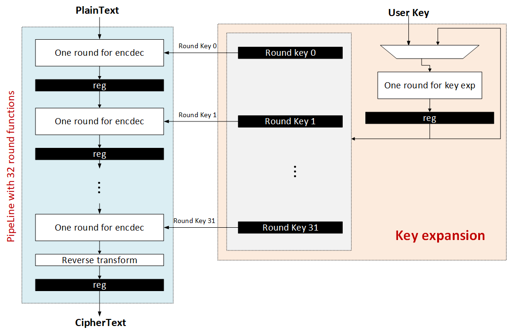
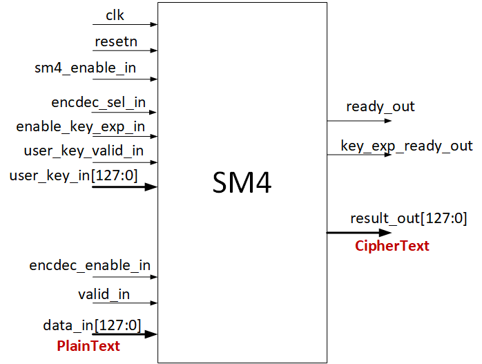
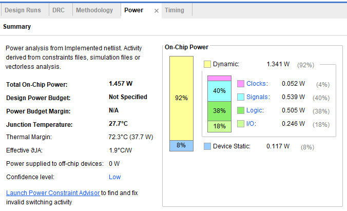

# FPGA implementation of Chinese SM4 encryption algorithm.

## Introduction

This project is an implementation of  Chinese SM4 (also known as sms4) encryption algorithm. 

### Features

- Pipeline architecture,
- 128-bit datapath,
- following algorithms are supported:
  * key expansion
  * Encryption
  * Decryption

## Architecture



## Interface



| Interface         | direction | width   | description                        |
| ----------------- | --------- | ------- | ---------------------------------- |
| clk               | in        | 1-bit   | clock signal                       |
| resetn            | in        | 1-bit   | reset signal, 0 reset              |
| sm4_enable_in     | in        | 1-bit   | enable sm4 core to work            |
| encdec_sel_in     | in        | 1-bit   | select of encryption or decryption |
| enable_key_exp_in | in        | 1-bit   | enable key expansion for sm4       |
| user_key_valid_in | in        | 1-bit   | valid signal of user key           |
| user_key_in       | in        | 128-bit | 128-bit user key                   |
| encdec_enable_in  | in        | 1-bit   | enable encryption to work          |
| valid_in          | in        | 1-bit   | valid signal of plain text         |
| data_in           | in        | 128-bit | plain text, 128-bit, 16 Bytes      |
| key_exp_ready_out | out       | 1-bit   | ready signal of key expansion      |
| ready_out         | out       | 1-bit   | ready signal of encryption result  |
| result_out        | out       | 128-bit | encryption result                  |


## Timing


> Timing diagram is edited by [WaveDrom](https://github.com/drom/wavedrom/releases)

```
{signal: [
  {name: 'clk', wave: 'p.....................|.'},
  {name: 'resetn', wave: '01....................|.'},
  {name: 'sm4_enable_in', wave: '0.1...................|.'},
  {name: 'encdec_sel_in', wave: '0.1...................|.'},
  {name: 'enable_key_exp_in', wave: '0..1..................|.'},
  {name: 'user_key_valid_in', wave: '0....10...............|.'},
  {name: 'user_key_in', wave: 'x....3x|..............|.',data:["Key"]},
  {name: 'key_exp_ready_out', wave: '0......|1.............|.'},
  {name: 'valid_in', wave: '0........|101010......|.'},
  {name: 'data_in', wave: 'x........|4x4x4x......|.', data:["Plain 1", "Plain 2", "Plain 3"]},
  {name: 'ready_out', wave: '0........|.....|101010|.'},
  {name: 'data_in', wave: 'x........|.....|5x5x5x|.', data:["Cpiher 1", "Cpiher 2","Cpiher 3",]},   
],
   config : { "hscale" : 2 }
}
```

## FPGA resource utilization


## FPGA  Power Report




## FPGA Timing Report

The period of clock is set to 2ns.

